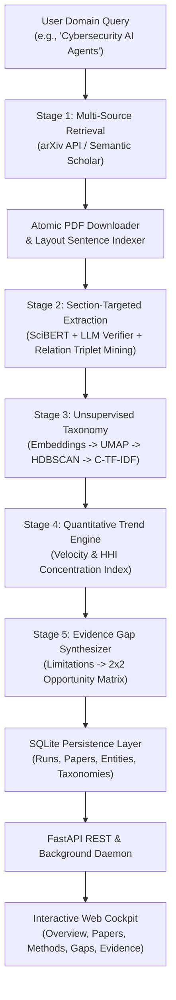

# TrendScope: Scientific Literature Intelligence Platform

[](https://www.python.org/)
[](https://fastapi.tiangolo.com)
[](LICENSE)
[]()

> **Turn scientific literature into structured intelligence.**  
> TrendScope is an evidence-grounded scientific literature intelligence engine that combines automated open-access retrieval, layout-aware PDF sentence parsing, 5-pillar information extraction, unsupervised taxonomy induction, econometric market concentration metrics (HHI), and automated research gap discovery.

---

## 🚀 Key Features

- **🌐 Autonomous Multi-Source Retrieval:** Queries arXiv and Semantic Scholar to discover, rank, and download target research papers with automatic PDF cache management.
- **📄 Layout-Aware Sentence Indexing:** Uses PyMuPDF to extract text into sentence units with precise metadata coordinates ($\text{Paper UID}, \text{Section}, \text{Index}$).
- **🔬 Section-Targeted Cascaded Extraction:**
  - Layout-aware section routing (Intro $\to$ Contributions, Methods $\to$ Algorithms, Experiments $\to$ Datasets/Metrics, Discussion $\to$ Limitations).
  - Scientific token tagger (`SciBERT`/`SciSpacy`) + LLM contextual verifier to eliminate generic noun pollution.
  - Scientific Relation Triplet Mining ($\langle \text{Method}, \text{EVALUATED\_ON}, \text{Dataset} \rangle$).
  - Cosine semantic canonicalization ($\ge 0.88$) and ontology linking (PapersWithCode).
  - Self-verification reflection filter ($\text{Confidence} \ge 0.80$).
- **📊 Unsupervised Taxonomy Induction:** Dense embeddings (`all-MiniLM-L6-v2`) + UMAP + HDBSCAN + Class-based TF-IDF (C-TF-IDF) cluster titling with dynamic mathematical HSL color generation.
- **📈 Econometric Trend & HHI Analytics:** Computes method growth velocity and the **Herfindahl-Hirschman Index ($HHI = \sum s_i^2$)** to detect dataset monopolization vs. healthy diversification.
- **🎯 2×2 Research Opportunity Matrix:** Synthesizes explicit scientific bottlenecks into an actionable matrix (Technical Maturity vs. Impact) with verbatim evidence quotes.
- **💻 Interactive SaaS Web Cockpit:** Built with FastAPI, SQLite, and vanilla CSS/JS featuring real-time proportional SVG donut charts, multi-session sidebar history, refresh persistence, and one-click Markdown export.

---

## 🏛️ System Architecture



---

## 📂 Project Structure

```
TrendScope/
├── backend/
│   ├── server.py               # FastAPI REST API & routes
│   └── pipeline_runner.py      # Background execution runner
├── retrieval/
│   ├── corpus.py               # Academic API retrieval & cache purge
│   └── workers.py              # Multi-threaded PDF downloader & sentence parser
├── extraction/
│   ├── pipeline.py             # Extraction orchestrator
│   ├── detector.py             # Section-targeted candidate detector
│   ├── extractor.py            # LLM structured extractor
│   ├── normalizer.py           # Canonicalization & ontology linker
│   ├── parser.py               # PDF layout parser
│   └── storage.py              # SQLite extraction persistence
├── taxonomy/
│   ├── induction.py            # UMAP + HDBSCAN + C-TF-IDF pipeline
│   └── clusterer.py            # Semantic clustering routines
├── trends/
│   ├── analyzer.py             # Trend velocity & HHI concentration engine
│   └── metrics.py              # Econometric formulas
├── gaps/
│   ├── miner.py                # Limitation & bottleneck extractor
│   ├── theme_clusterer.py      # Thematic gap clustering & 2x2 matrix
│   └── storage.py              # Research gaps database models
├── web/
│   ├── index.html              # Cockpit user interface
│   ├── app.js                  # Frontend state management & SVG chart engine
│   └── styles.css              # Light theme design system & grid layout
├── data/
│   └── trendscope.db           # Relational SQLite database
├── main.py                     # CLI pipeline entry point
├── requirements.txt            # Python dependencies
├── .env.example                # Environment variables template
└── TrendScope_Comprehensive_Project_Report_and_Research_Paper.md # Academic Report
```

---

## ⚡ Quickstart & Installation

### 1. Clone the Repository
```bash
git clone https://github.com/your-username/TrendScope.git
cd TrendScope
```

### 2. Set Up Virtual Environment
```bash
python -m venv .venv

# On Windows:
.venv\Scripts\activate

# On macOS/Linux:
source .venv/bin/activate
```

### 3. Install Dependencies
```bash
pip install -r requirements.txt
```

### 4. Configure Environment Variables
```bash
cp .env.example .env
# Edit .env with your optional credentials or use local Ollama
```

### 5. Launch the Web Application
```bash
python -m uvicorn backend.server:app --host 127.0.0.1 --port 8085
```
Open your browser and navigate to:
```
http://127.0.0.1:8085
```

---

## 📖 Academic Documentation

The complete academic thesis report and publication manuscript is available at:
📄 **[TrendScope_Comprehensive_Project_Report_and_Research_Paper.md](TrendScope_Comprehensive_Project_Report_and_Research_Paper.md)**

It includes:
- Departmental Bonafide Certificate & Acknowledgements (Rajalakshmi Engineering College / Anna University format).
- Full theoretical foundations and mathematical formulations (Cosine similarity, C-TF-IDF, HHI concentration, composite gap scoring).
- Detailed database entity-relationship schema.
- Real-world case study results on Cybersecurity AI Agents, Medical LLMs, and Industrial AI.

---

## 📄 License

This project is licensed under the MIT License — see the [LICENSE](LICENSE) file for details.
