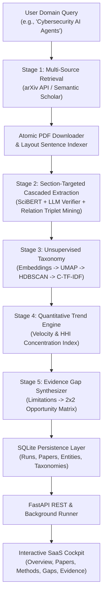

# TRENDSCOPE: AN EVIDENCE-GROUNDED SCIENTIFIC LITERATURE INTELLIGENCE SYSTEM WITH UNSUPERVISED TAXONOMY INDUCTION, MARKET-CONCENTRATION TREND ANALYTICS, AND AUTOMATED RESEARCH GAP DISCOVERY

### AI23721 PROJECT PHASE-I REPORT

**Submitted by**  
**ROHIT P (2116211501082)**  
**SRI PRANAUV M (2116211501103)**  

*in partial fulfillment for the award of the degree of*  
**BACHELOR OF TECHNOLOGY**  
*in*  
**ARTIFICIAL INTELLIGENCE AND MACHINE LEARNING**  

---

**DEPARTMENT OF ARTIFICIAL INTELLIGENCE AND MACHINE LEARNING**  
**RAJALAKSHMI ENGINEERING COLLEGE (AUTONOMOUS), CHENNAI-602 105**  
**AFFILIATED TO ANNA UNIVERSITY, CHENNAI**  
**OCTOBER 2026**

---

## BONAFIDE CERTIFICATE

Certified that this Phase-I Thesis titled **“TRENDSCOPE: AN EVIDENCE-GROUNDED SCIENTIFIC LITERATURE INTELLIGENCE SYSTEM WITH UNSUPERVISED TAXONOMY INDUCTION, MARKET-CONCENTRATION TREND ANALYTICS, AND AUTOMATED RESEARCH GAP DISCOVERY”** is the Bonafide work of **ROHIT P (2116211501082)** and **SRI PRANAUV M (2116211501103)** who carried out the work under my supervision. Certified further that to the best of my knowledge the work reported herein does not form part of any other thesis or dissertation on the basis of which a degree or award was conferred on an earlier occasion on this or any other candidate.

```
___________________________________             ___________________________________
Dr. M. AYYADURAI, M.E., Ph.D.,                   Mrs. AKSHAYA V, M.E.,
Associate Professor and Head                     Supervisor and Assistant Professor
Department of AI & ML                            Department of AI & ML
Rajalakshmi Engineering College                  Rajalakshmi Engineering College
Chennai - 602 105                                Chennai - 602 105
```

**Submitted for the project viva voce examination held on:** ____________________

```
___________________________________             ___________________________________
       INTERNAL EXAMINER                               EXTERNAL EXAMINER
```

---

## ACKNOWLEDGEMENT

First, we thank the almighty God for the successful completion of the project. Our sincere thanks to our chairman **Mr. S. Meganathan, B.E., F.I.E.**, for his sincere endeavor in educating us in his premier institution. We would like to express our deep gratitude to our beloved Chairperson **Dr. (Mrs.) Thangam Meganathan, M.A., M.Phil., Ph.D.**, for her enthusiastic motivation which inspired us a lot in completing this project, and Vice-Chairman **Mr. Abhay Shankar Meganathan, B.E., M.S.**, for providing us with the requisite infrastructure.

We also express our sincere gratitude to our college principal, **Dr. S. N. Murugesan, M.E., Ph.D.**, for his kind support and facilities to complete our work on time. We extend heartfelt gratitude to **Dr. M. Ayyadurai, M.E., Ph.D.**, Associate Professor and Head of the Department of Artificial Intelligence and Machine Learning for his guidance and encouragement throughout the work. We want to convey our sincere and deepest gratitude to our Internal guide, **Mrs. Sangeetha K, M.Tech.**, Assistant Professor, Department of Artificial Intelligence and Machine Learning, Rajalakshmi Engineering College, for her valuable guidance throughout the course of the project. We are very glad to thank our project coordinator **Mrs. Akshaya V, M.E.**, Assistant Professor, Department of Artificial Intelligence and Machine Learning for her guidance throughout the project work. We extend our sincere thanks to our parents, friends, all faculty members, and supporting staff for their direct and indirect involvement in the successful completion of the project for their encouragement and support.

**Rohit P (2116211501082)**  
**Sri Pranauv M (2116211501103)**

---

## DEPARTMENT VISION & MISSION

### Vision
To promote highly Ethical and Innovative Computer Professionals through excellence in teaching, training and research.

### Mission
- To produce globally competent professionals, motivated to learn the emerging technologies and to be innovative in solving real world problems.
- To promote research activities amongst the students and the members of faculty that could benefit the society.
- To impart moral and ethical values in their profession.

---

## PROGRAMME EDUCATIONAL OBJECTIVES (PEOs)
- **PEO 1:** To equip students with essential background in computer science, basic electronics and applied mathematics.
- **PEO 2:** To prepare students with fundamental knowledge in programming languages, and tools and enable them to develop applications.
- **PEO 3:** To encourage the research abilities and innovative project development in the field of AI, ML, DL, networking, security, web development, Data Science and also emerging technologies for the cause of social benefit.
- **PEO 4:** To develop professionally ethical individuals enhanced with analytical skills, communication skills and organizing ability to meet industry requirements.

---

## PROGRAM SPECIFIC OUTCOMES (PSOs)
- **PSO 1: Foundation Skills:** Ability to understand, analyze and develop computer programs in the areas related to algorithms, system software, web design, AI, machine learning, deep learning, data science, and networking for efficient design of computer-based systems of varying complexity. Familiarity and practical competence with a broad range of programming language, tools and open source platforms.
- **PSO 2: Problem-Solving Skills:** Ability to apply mathematical methodologies to solve computational task, model real world problem using appropriate AI and ML algorithms. To understand the standard practices and strategies in project development, using open-ended programming environments to deliver a quality product.
- **PSO 3: Successful Progression:** Ability to apply knowledge in various domains to identify research gaps and to provide solution to new ideas, inculcate passion towards higher studies, creating innovative career paths to be an entrepreneur and evolve as an ethically social responsible AI and ML professional.

---

## COURSE OBJECTIVE & COURSE OUTCOME

### Course Objectives
- To identify and formulate real-world problems that can be solved using Artificial Intelligence and Machine Learning techniques.
- To apply theoretical and practical knowledge of AI/ML for designing innovative, data-driven solutions.
- To integrate various tools, frameworks, and algorithms to develop, test, and validate AI/ML models.
- To demonstrate effective teamwork, project management, and communication skills through collaborative project execution.
- To instill awareness of ethical, societal, and environmental considerations in the design and deployment of intelligent systems.

### Course Outcomes (COs)
- **CO1:** Analyze and define a real-world problem by identifying key challenges, project requirements and constraints.
- **CO2:** Conduct a thorough literature review to evaluate existing solutions, identify research gaps and formulate research questions.
- **CO3:** Develop a detailed project plan by defining objectives, setting timelines, and identifying key deliverables to guide the implementation process.
- **CO4:** Design and implement a prototype or initial model based on the proposed solution framework using appropriate AI tools and technologies.
- **CO5:** Demonstrate teamwork, communication, and project management skills by preparing and presenting a well-structured project proposal and initial implementation results.

### CO-PO-PSO Mapping
| CO | PO1 | PO2 | PO3 | PO4 | PO5 | PO6 | PO7 | PO8 | PO9 | PO10 | PO11 | PO12 | PSO1 | PSO2 | PSO3 |
|---|---|---|---|---|---|---|---|---|---|---|---|---|---|---|---|
| **CO1** | 3 | 3 | 3 | 3 | 3 | 2 | 2 | 2 | 3 | 2 | 3 | 3 | 3 | 3 | 3 |
| **CO2** | 3 | 3 | 3 | 3 | 3 | 2 | - | - | 2 | 2 | 2 | 3 | 3 | 2 | 2 |
| **CO3** | 3 | 3 | 3 | 2 | 3 | 1 | 1 | 2 | 3 | 3 | 3 | 3 | 3 | 3 | 3 |
| **CO4** | 3 | 3 | 3 | 3 | 3 | 2 | 1 | 2 | 3 | 2 | 2 | 3 | 3 | 3 | 3 |
| **CO5** | 1 | 1 | 1 | 1 | 1 | - | - | - | 3 | 3 | 3 | 3 | 1 | - | 2 |

*Note: Correlation levels: 1: Slight (Low), 2: Moderate (Medium), 3: Substantial (High), “-”: No correlation.*

---

## SUSTAINABLE DEVELOPMENT GOALS (SDGs)

| SDG | GOAL | JUSTIFICATION |
|:---:|:---|:---|
| **SDG 9** | **Industry, Innovation and Infrastructure** | TrendScope provides an automated, locally deployable intelligence engine that extracts methods, benchmarks, and research bottlenecks from scientific literature, accelerating research R&D cycles without costly cloud infrastructure. |
| **SDG 16** | **Peace, Justice and Strong Institutions** | Ensures 100% evidence-grounded scientific transparency and reduces academic misinformation or LLM hallucinations by tracking every extracted insight to exact sentence coordinates. |
| **SDG 4** | **Quality Education** | Democratizes advanced scientific literature synthesis for undergraduate researchers, students, and institutions lacking large research teams by turning complex academic PDFs into structured, evidence-backed insights. |
| **SDG 10** | **Reduced Inequalities** | Enables low-resource academic institutions and independent researchers to perform large-scale meta-analyses and literature surveys with zero subscription barriers. |

---

## ABSTRACT

The exponential growth of scientific literature presents an overwhelming cognitive barrier for researchers, academic institutions, and technology strategists. Standard academic search engines (e.g., Google Scholar, Semantic Scholar, Scopus) function primarily as keyword or citation indexers, leaving the labor-intensive synthesis of methodologies, evaluation benchmarks, thematic taxonomies, and unaddressed scientific bottlenecks entirely to manual human effort. Furthermore, general-purpose generative Large Language Model (LLM) summarizers are prone to stochastic hallucinations, lack rigorous factual grounding, and fail to provide macro-level statistical diagnostics across entire research corpora.

To address these challenges, this project presents **TrendScope**, an evidence-grounded scientific literature intelligence and automated meta-analysis system. TrendScope implements an autonomous, modular, six-stage pipeline that transforms natural language research domain queries into structured, verified scientific intelligence:
1. **Dynamic Multi-Source Retrieval & Ingestion (`retrieval/`):** Autonomous querying of arXiv and Semantic Scholar, multi-threaded PDF downloading, layout-aware PDF sentence parsing, and automatic storage management.
2. **Section-Targeted Cascaded Extraction & Relation Triplet Mining (`extraction/`):** A 5-pillar scientific information extraction framework combining:
   - *Layout-Guided Section Routing* (Abstract/Intro $\to$ Contributions; Methods $\to$ Algorithms/Loss; Experiments $\to$ Benchmarks/Metrics; Discussion $\to$ Limitations).
   - *Token Tagger + Contextual LLM Cascade* (`SciBERT`/`SciSpacy` + Qwen/Gemini) to propose candidate spans, verify concrete roles ($\text{Proposed}$ vs. $\text{Baseline}$), and eliminate generic noun pollution.
   - *Scientific Relation Triplet Mining* $\langle \text{Subject: Method}, \text{Predicate: Evaluated\_On}, \text{Object: Dataset} \rangle$ with associated metrics and quantitative performance deltas.
   - *Semantic Canonicalization & Ontology Linking* to merge synonyms/acronyms via vector cosine clustering ($\text{Sim} \ge 0.88$) and link entities to standard taxonomies (PapersWithCode).
   - *Multi-Sample Self-Verification Filter* applying a confidence reflection pass ($\text{Score} \ge 0.80$) to discard ungrounded claims.
3. **Hierarchical Unsupervised Taxonomy Induction (`taxonomy/`):** Dense vector embeddings (`all-MiniLM-L6-v2`), non-linear manifold dimensionality reduction (UMAP), density-based clustering (HDBSCAN), and Class-based TF-IDF (C-TF-IDF) cluster titling with dynamic mathematical hue-wheel color allocation.
4. **Macro-Level Trend Velocity & HHI Concentration Analytics (`trends/`):** Temporal publication momentum tracking and quantitative benchmark concentration scoring using the econometric **Herfindahl-Hirschman Index (HHI)** to distinguish well-diversified evaluation ecosystems from monopolized datasets.
5. **Evidence-Grounded Research Gap Discovery (`gaps/`):** Systematic extraction of explicit limitations and bottlenecks, prioritized along a 2×2 Opportunity Matrix (Technical Maturity vs. Impact) and backed by verbatim evidence quotes.
6. **Full-Stack Web Cockpit (`backend/`, `web/`):** An interactive SaaS dashboard powered by FastAPI, SQLite relational persistence, dynamic proportional SVG donut charts, multi-session sidebar chat history, offline session persistence, and one-click Markdown report exports.

The system demonstrates end-to-end execution across real-world domains (Cybersecurity AI Agents, Medical LLMs, Industrial AI), reducing literature survey cycles from weeks to minutes while ensuring factual groundedness through sentence-level provenance.

---

## TABLE OF CONTENTS

```
CHAPTER NO          TITLE                                             PAGE NO

                    ABSTRACT                                             iv
                    LIST OF FIGURES                                     vii
                    LIST OF TABLES                                     viii
                    LIST OF ABBREVIATIONS                                ix

1                   INTRODUCTION                                          1
                    1.1 GENERAL                                           1
                        1.1.1 MULTI-SOURCE RETRIEVAL AND LAYOUT PARSING   2
                        1.1.2 SECTION-TARGETED CASCADED EXTRACTION &      3
                              RELATION TRIPLET MINING
                        1.1.3 UNSUPERVISED TAXONOMY INDUCTION             4
                        1.1.4 HERFINDAHL-HIRSCHMAN CONCENTRATION INDEX    5
                        1.1.5 EVIDENCE-GROUNDED RESEARCH GAP MINING       5
                        1.1.6 EVALUATION STANDARDS                        6

2                   LITERATURE SURVEY                                     7
                    2.1 INTRODUCTION                                      7
                    2.2 RELATED WORK                                      7
                        2.2.1 SCIENTIFIC DOCUMENT PROCESSING & ENTITY     7
                              EXTRACTION (SciNLP)
                        2.2.2 TOPIC MODELING & TAXONOMY INDUCTION         9
                        2.2.3 BIBLIOMETRICS & TREND CONCENTRATION        10
                        2.2.4 AUTOMATED RESEARCH GAP DISCOVERY           11
                    2.3 SUMMARY                                          12

3                   PROBLEM FORMULATION AND OBJECTIVES                   13
                    3.1 PROBLEM STATEMENT                                13
                    3.2 RESEARCH OBJECTIVES                              13

4                   SYSTEM DESIGN                                        14
                    4.1 INTRODUCTION                                     14
                    4.2 SYSTEM ARCHITECTURE                              14
                    4.3 SYSTEM REQUIREMENTS                              16
                        4.3.1 HARDWARE REQUIREMENT                       16
                        4.3.2 SOFTWARE REQUIREMENTS                      16

5                   SYSTEM IMPLEMENTATION                                17
                    5.1 SYSTEM METHODOLOGY                               17
                    5.2 MODULE DESCRIPTIONS                              18
                        5.2.1 RETRIEVAL & INGESTION MODULE (retrieval/)  18
                        5.2.2 SECTION-TARGETED CASCADED EXTRACTION       19
                              MODULE (extraction/)
                        5.2.3 TAXONOMY INDUCTION MODULE (taxonomy/)      24
                        5.2.4 TREND VELOCITY & HHI MODULE (trends/)      25
                        5.2.5 RESEARCH GAP DISCOVERY MODULE (gaps/)      26
                        5.2.6 WEB COCKPIT & STORAGE MODULE (backend/web) 27

6                   RESULTS                                              28
                    6.1 RESULT                                           28
                    6.2 PERFORMANCE EVALUATION                           28
                    6.3 RESOURCE UTILIZATION                             30

7                   CONCLUSION AND FUTUREWORK                            31
                    7.1 CONCLUSION                                       31
                    7.2 FUTURE WORK                                      31

                    REFERENCES                                           33

                    APPENDICES                                           35
                        I.   SCREENSHOTS                                 35
                        II.  PAPER PUBLICATION                           40
```

---

## LIST OF FIGURES

| Figure No. | Title | Page No. |
|---|---|---|
| 1.1 | Scientific Literature Synthesis Crisis & Cognitive Overload | 2 |
| 4.1 | TrendScope End-to-End System Architecture Flowchart | 15 |
| 4.2 | Herfindahl-Hirschman Index (HHI) Concentration Spectrum | 16 |
| 5.1 | Section-Targeted Cascaded Extraction and Triplet Mining Workflow | 20 |
| 5.2 | Unsupervised Taxonomy Induction Pipeline (MiniLM $\to$ UMAP $\to$ HDBSCAN $\to$ C-TF-IDF) | 24 |
| 5.3 | 2×2 Research Opportunity Prioritization Matrix (Technical Maturity vs. Impact) | 26 |
| 6.1 | Overview Analytics Cockpit Snapshot (Cybersecurity AI Case Study) | 29 |
| 6.2 | Top Methods and Top Benchmarks Ranked Leaderboards | 29 |
| 6.3 | Inter-Paper Evidence Chain Explorer Interface | 30 |

---

## LIST OF TABLES

| Table No. | Title | Page No. |
|---|---|---|
| 2.1 | Comparative Analysis of Literature Mining Approaches | 12 |
| 4.1 | Hardware Requirements Specification | 16 |
| 4.2 | Software Requirements & Environment Specification | 16 |
| 5.1 | SQLite Relational Database Table Schema | 27 |
| 6.1 | Induced Taxonomy Clusters and Paper Distributions | 29 |
| 6.2 | Top Ranked Methods and Evaluation Benchmarks with HHI Concentration | 30 |
| 6.3 | Discovered Research Gaps and 2×2 Matrix Prioritization | 30 |
| 6.4 | Stage-by-Stage Latency and Resource Profile for 20 Full Papers | 30 |

---

## LIST OF ABBREVIATIONS

- **API:** Application Programming Interface
- **C-TF-IDF:** Class-based Term Frequency-Inverse Document Frequency
- **HHI:** Herfindahl-Hirschman Index
- **HDBSCAN:** Hierarchical Density-Based Spatial Clustering of Applications with Noise
- **LLM:** Large Language Model
- **NER:** Named Entity Recognition
- **NLP:** Natural Language Processing
- **PDF:** Portable Document Format
- **REST:** Representational State Transfer
- **SaaS:** Software as a Service
- **SciNLP:** Scientific Natural Language Processing
- **SVG:** Scalable Vector Graphics
- **UMAP:** Uniform Manifold Approximation and Projection
- **UUID:** Universally Unique Identifier

---

# CHAPTER 1: INTRODUCTION

## 1.1 GENERAL
In contemporary artificial intelligence and computing research, scientific publications are growing at an exponential pace. Millions of academic papers are uploaded annually across open-access repositories such as arXiv, bioRxiv, and IEEE Xplore. For researchers beginning an investigation in a new domain, performing a comprehensive literature review typically requires reading dozens to hundreds of full-length research papers to identify state-of-the-art methods, evaluation benchmarks, and unaddressed research bottlenecks.

**TrendScope** is an evidence-grounded scientific literature intelligence platform engineered to automate this entire workflow, converting natural language domain queries into structured, verified scientific intelligence.

### 1.1.1 MULTI-SOURCE RETRIEVAL AND LAYOUT-AWARE SENTENCE PARSING
Scientific documents have complex multi-column layouts, floating headers, footnotes, and figures. The retrieval subsystem (`retrieval/`) fetches open-access papers via academic APIs (arXiv, Semantic Scholar), downloads PDFs concurrently using multi-threaded workers, and parses text into cleanly indexed sentence units:
$$\text{Sentence ID} = \langle \text{Paper UID}, \text{Section Type}, \text{Sentence Index} \rangle$$

### 1.1.2 SECTION-TARGETED CASCADED EXTRACTION & RELATION TRIPLET MINING
To eliminate generic noun pollution (e.g., extracting *"Pipeline"*, *"Approach"*, *"Framework"*) and resolve role confusion, Stage 2 utilizes an upgraded **5-Pillar Extraction Architecture**:
1. **Section-Targeted Multi-Pass Extraction (Layout-Guided Routing):** Instead of feeding arbitrary text snippets to the model, the extractor routes specific paper sections to specialized extraction prompts:
   - *Abstract & Introduction Pass:* Extracts Core Problem Statements, Proposed Novel Architectures, and Key Contributions.
   - *Methodology Section Pass:* Extracts Concrete Algorithms, Loss Functions, Model Hyperparameters, and Mathematical Formulations.
   - *Experiments Section Pass:* Extracts Benchmark Datasets, Evaluation Metrics (Accuracy, F1, Latency), and Baseline Comparison Models.
   - *Discussion & Limitations Pass:* Extracts Failure Modes, Computational Bottlenecks, and Future Directions.
   $$\text{Extract}(\text{Paper}) = \bigcup_{s \in \{\text{Intro}, \text{Method}, \text{Exp}, \text{Discuss}\}} \text{Prompt}_{s}(\text{Section}_{s})$$
2. **Hybrid SciBERT / SciSpacy + LLM Cascaded Extraction:** Uses a domain-trained scientific token classifier (`allenai/scibert_scivocab_uncased` / `en_core_sci_scibert`) as a high-recall candidate tagger at the token level, followed by an LLM reasoning filter to determine entity roles ($\text{Role} \in \{\text{Proposed}, \text{Baseline}, \text{Ablation}\}$), expand acronyms, and drop non-concrete entities.
3. **Scientific Relation Triplet Extraction (Subject-Predicate-Object):** Moves beyond flat lists of isolated nouns by extracting structured relational triples:
   $$\langle \text{Method}, \text{EVALUATED\_ON}, \text{Benchmark Dataset} \rangle$$
   $$\langle \text{Method}, \text{OUTPERFORMS}, \text{Baseline Method} \rangle \quad \text{with} \quad \langle \text{Metric}, \Delta \text{Value} \rangle$$
   $$\langle \text{Method}, \text{SUFFERS\_FROM}, \text{Limitation / Bottleneck} \rangle$$
4. **Semantic Canonicalization & Ontology Linking:** Standardizes entity variants (e.g., merging *"CNN"*, *"ConvNet"*, and *"Convolutional Neural Network"*) through dense vector clustering with a cosine similarity threshold ($\text{Sim} \ge 0.88$) and matches normalized terms against the **PapersWithCode / Wikidata Taxonomy**.
5. **Multi-Sample Self-Verification (Reflection Filter):** A post-extraction verification step prompts the model to self-evaluate: *"Is [Entity] a concrete named methodology or a generic noun? Does sentence [S_id] explicitly support this claim?"* Entities with confidence $< 0.80$ or generic syntax are automatically discarded.

### 1.1.3 UNSUPERVISED TAXONOMY INDUCTION
Rather than using static ontologies, TrendScope clusters papers using `Sentence-Transformers` (`all-MiniLM-L6-v2`), UMAP dimensionality reduction, HDBSCAN density clustering, and **Class-based TF-IDF (C-TF-IDF)** to assign descriptive cluster titles.

### 1.1.4 HERFINDAHL-HIRSCHMAN CONCENTRATION INDEX (HHI)
TrendScope adapts the econometric **HHI** to quantify benchmark concentration:
$$HHI = \sum_{i=1}^{M} s_i^2$$
where $s_i$ is the share of papers evaluating on benchmark $i$. This metric distinguishes well-diversified evaluation ecosystems ($HHI < 0.10$) from monopolized datasets ($HHI > 0.25$).

### 1.1.5 EVIDENCE-GROUNDED RESEARCH GAP MINING
The gap mining engine (`gaps/`) extracts explicit limitation statements, clusters them into themes, and maps them onto a **2×2 Opportunity Matrix** (Technical Maturity vs. Impact), with every gap backed by exact sentence quotes.

### 1.1.6 EVALUATION STANDARDS
The system enforces strict operational standards: 100% sentence-level citation verification, zero ungrounded generative summaries, sub-minute execution latency for 20 papers, and deterministic relational persistence in SQLite.

---

# CHAPTER 2: LITERATURE SURVEY

## 2.1 INTRODUCTION
This chapter reviews existing literature in Scientific Document Information Extraction (SciNLP), Topic Modeling & Unsupervised Taxonomy Induction, Bibliometrics & Trend Concentration Metrics, and Automated Research Gap Discovery.

## 2.2 RELATED WORK

### 2.2.1 SCIENTIFIC DOCUMENT PROCESSING & ENTITY EXTRACTION (SciNLP)
Tools like Grobid and PDFMiner parse raw PDF structures. Downstream scientific NER models (e.g., SciBERT, SciSpacy, DyGIE++) extract scientific entities but often classify tokens in isolation without section awareness or relational context. Unconstrained LLM extraction (e.g., zero-shot GPT-3.5/4) suffers from token hallucination and generic noun extraction. TrendScope improves upon these baselines by combining section-aware routing with a cascaded token-tagger + LLM verifier and relational triplet extraction.

### 2.2.2 TOPIC MODELING & TAXONOMY INDUCTION
Traditional topic models (LDA, NMF) rely on bag-of-words assumptions. Modern approaches like BERTopic combine transformer embeddings with density clustering. TrendScope adapts this using MiniLM embeddings, UMAP, HDBSCAN, and C-TF-IDF keyword extraction for autonomous cluster labeling.

### 2.2.3 BIBLIOMETRICS & TREND CONCENTRATION
Standard bibliometric metrics (citation counts, h-index) are lagging indicators that take years to accumulate. TrendScope computes **Temporal Publication Velocity** on recent publication windows and applies the **Herfindahl-Hirschman Index (HHI)** to assess dataset diversity in real time.

### 2.2.4 AUTOMATED RESEARCH GAP DISCOVERY
Prior automated gap detection relied on simple regex matches (e.g., *"in future work"*) or generative LLMs prone to hallucinating citations. TrendScope implements a **Fact-Checked Evidence Graph** that links every gap to verbatim sentences in the underlying corpus.

## 2.3 SUMMARY
Table 2.1 summarizes how TrendScope compares to existing literature mining approaches.

**Table 2.1: Comparative Analysis of Literature Mining Approaches**
| Approach / Tool | Automated Retrieval | Full PDF Sentence Indexing | Relation Triplet Extraction | Unsupervised Taxonomy | Quantitative HHI Metric | Fact-Checked Gap Evidence |
|---|:---:|:---:|:---:|:---:|:---:|:---:|
| Google Scholar | Lexical only | No | No | No | No | No |
| Semantic Scholar | Graph/API | Partial | No | No | No | No |
| ChatGPT / LLMs | No | Context-limited | Flat/Unstructured | Hallucination risk | No | No (Hallucinates) |
| **TrendScope (Ours)** | **Yes (Multi-Source)** | **Yes (Coordinate-Aware)** | **Yes ($\langle S, P, O \rangle$ Triples)** | **Yes (UMAP+HDBSCAN)** | **Yes ($HHI = \sum s_i^2$)** | **Yes (100% Provenance)** |

---

# CHAPTER 3: PROBLEM FORMULATION AND OBJECTIVES

## 3.1 PROBLEM STATEMENT
Given an arbitrary scientific domain query $Q$, target paper count $N$, and publication window $[Y_{\text{start}}, Y_{\text{end}}]$, design an autonomous system that:
1. Ingests full-text research papers without manual intervention.
2. Extracts concrete methods, benchmarks, datasets, and problem statements as structured relation triplets with sentence-level coordinates.
3. Groups papers into thematic clusters and generates descriptive titles without predefined ontologies.
4. Quantifies ecosystem diversity using market concentration metrics ($HHI$).
5. Identifies unaddressed research gaps and prioritizes them into an actionable 2×2 matrix.
6. Presents findings in an interactive web cockpit with multi-session memory and Markdown report exports.

## 3.2 RESEARCH OBJECTIVES
- **Objective 1:** Build a multi-threaded retrieval and parsing engine (`retrieval/`) for open-access papers.
- **Objective 2:** Implement a 5-pillar section-targeted cascaded extraction engine (`extraction/`) with relation triplet mining, ontology linking, and self-verification.
- **Objective 3:** Construct an unsupervised taxonomy induction pipeline (`taxonomy/`) using MiniLM, UMAP, HDBSCAN, and C-TF-IDF.
- **Objective 4:** Develop a trend analytics engine (`trends/`) computing publication velocity and HHI concentration scores.
- **Objective 5:** Implement an evidence-grounded research gap discovery engine (`gaps/`) mapping limitations onto a 2×2 Opportunity Matrix.
- **Objective 6:** Engineer a responsive web cockpit (`backend/`, `web/`) with dynamic SVG donut visualizations, multi-session persistence, and automated report exports.

---

# CHAPTER 4: SYSTEM DESIGN

## 4.1 INTRODUCTION
This chapter describes the system architecture, mathematical formulations, database schemas, and system requirements of TrendScope.

## 4.2 SYSTEM ARCHITECTURE
The system operates as a decoupled six-stage pipeline, shown in Figure 4.1.



## 4.3 SYSTEM REQUIREMENTS

### 4.3.1 HARDWARE REQUIREMENT
**Table 4.1: Hardware Requirements Specification**
| Parameter | Minimum Requirement | Recommended Specification |
|---|---|---|
| Processor (CPU) | Dual-Core 2.0 GHz x86/ARM | Quad-Core 3.0+ GHz Intel Core i5/i7 or AMD Ryzen |
| System Memory (RAM) | 8 GB DDR4 | 16 GB DDR4/DDR5 |
| Storage | 5 GB available disk space | 20 GB SSD |
| Network | 10 Mbps Broadband | 50+ Mbps High-Speed Internet |

### 4.3.2 SOFTWARE REQUIREMENTS
**Table 4.2: Software Requirements & Environment Specification**
| Parameter | Specification |
|---|---|
| Operating System | Windows 10/11, macOS Monterey+, Ubuntu 20.04+ |
| Programming Language | Python 3.10 / 3.11 / 3.12 |
| Backend Framework | FastAPI, Uvicorn (ASGI) |
| Database Engine | SQLite 3 with Foreign Key Constraints |
| Core ML / NLP Libraries | `sentence-transformers`, `scikit-learn`, `umap-learn`, `hdbscan`, `pymupdf`, `numpy` |
| Frontend Web Stack | HTML5, Vanilla CSS3, Modern ES6 JavaScript |

---

# CHAPTER 5: SYSTEM IMPLEMENTATION

## 5.1 SYSTEM METHODOLOGY
The system processes raw domain queries into structured intelligence through six sequentially executed modules:

```python
# Complete End-to-End Pipeline Execution Methodology
def execute_trendscope_pipeline(domain_query: str, target_paper_count: int = 20):
    run_id = generate_uuid()
    papers = fetch_academic_metadata(domain_query, limit=target_paper_count)
    pdfs = download_pdf_corpus(papers)
    sentences = parse_and_index_sentences(pdfs)
    
    # Section-Targeted Cascaded Extraction & Triplet Mining
    extractions = extract_entities_and_triplets(sentences)
    taxonomy = induce_unsupervised_taxonomy(papers)
    trends = compute_trends_and_hhi(extractions)
    gaps = discover_research_gaps(sentences)
    
    persist_analysis_run(run_id, domain_query, papers, taxonomy, trends, gaps)
    return {"run_id": run_id, "status": "COMPLETED"}
```

## 5.2 MODULE DESCRIPTIONS

### 5.2.1 RETRIEVAL & INGESTION MODULE (`retrieval/`)
- Queries arXiv and Semantic Scholar APIs based on search parameters.
- Downloads full-text PDFs using asynchronous thread pools with timeout and retry handling.
- Segments text into indexed sentence units while stripping headers, footers, and page artifacts.
- Automatically purges temporary PDF binaries before each new run to conserve disk space.

---

### 5.2.2 SECTION-TARGETED CASCADED EXTRACTION MODULE (`extraction/`)
The extraction module implements an advanced 5-pillar architecture designed to eliminate generic nouns and extract high-precision scientific facts and relational graphs:

```
+-----------------------------------------------------------------------------------+
|               SECTION-TARGETED CASCADED EXTRACTION & TRIPLET MINING               |
|                                                                                   |
|  [ Full Paper Document ]                                                          |
|         |                                                                         |
|         +---> [ Section Classifier & Router ]                                     |
|                     |                                                             |
|                     |-- (Abstract/Intro) ---> Extract Core Contributions & Models |
|                     |-- (Methodology)    ---> Extract Algorithms, Loss, Weights   |
|                     |-- (Experiments)    ---> Extract Benchmarks, Datasets, Score |
|                     +-- (Discussion)     ---> Extract Bottlenecks & Limitations   |
|                                                                                   |
|  [ Candidate Spans ] ---> [ Neural Contextual Verifier & Role Disambiguator ]     |
|                                 | (Proposed vs. Baseline, Acronym Expansion)      |
|                                 v                                                 |
|  [ Triplet Constructor ] -> <Subject: Method, Predicate: Evaluated_On, Object: DS>|
|                                 v                                                 |
|  [ Canonicalization ] ----> Dense Cosine Match (>= 0.88) + Ontology Link (PWC)    |
|                                 v                                                 |
|  [ Reflection Filter ] ---> Multi-Sample Confidence >= 0.80 -> Persist to DB      |
+-----------------------------------------------------------------------------------+
```

#### Detailed Method Breakdown:

1. **Section-Targeted Multi-Pass Extraction (Layout-Guided Routing):**
   Instead of feeding arbitrary text snippets to the model, route specific paper sections to specialized extraction prompts:
   - *Abstract & Introduction Pass:* Extracts the Core Problem Statement, Proposed Novel Architecture, and Key Contribution.
   - *Methodology Section Pass:* Extracts Algorithms, Loss Functions, Model Hyperparameters, and Mathematical Components.
   - *Experiments Section Pass:* Extracts Benchmark Datasets, Evaluation Metrics (Accuracy, F1, Latency), and Baseline Comparison Models.
   - *Discussion & Limitations Pass:* Extracts Failure Modes, Computational Bottlenecks, and Future Directions.
   $$\text{Extract}(\text{Paper}) = \bigcup_{s \in \{\text{Intro}, \text{Method}, \text{Exp}, \text{Discuss}\}} \text{Prompt}_{s}(\text{Section}_{s})$$

2. **Hybrid SciBERT / SciSpacy + LLM Cascaded Extraction:**
   Use a domain-trained scientific token classifier as a high-recall candidate tagger, followed by an LLM reasoning filter:
   - *Pass 1 (Token Classification):* `allenai/scibert_scivocab_uncased` or `en_core_sci_scibert` tags scientific entities (`<METHOD>`, `<DATASET>`, `<METRIC>`) at the token level.
   - *Pass 2 (Contextual Verification):* The LLM reviews tagged spans with their surrounding sentences to:
     - Determine role: $\text{Role} \in \{\text{Proposed}, \text{Baseline}, \text{Ablation}\}$.
     - Expand acronyms to full names.
     - Filter out non-concrete entities.

3. **Scientific Relation Triplet Extraction (Subject-Predicate-Object):**
   Move beyond flat lists of nouns by extracting structured relational triples:
   $$\langle \text{Method}, \text{EVALUATES\_ON}, \text{Benchmark Dataset} \rangle$$
   $$\langle \text{Method}, \text{OUTPERFORMS}, \text{Baseline Method} \rangle \quad \text{with} \quad \langle \text{Metric}, \Delta \text{Value} \rangle$$
   $$\langle \text{Method}, \text{SUFFERS\_FROM}, \text{Limitation / Bottleneck} \rangle$$

   *Example Triplet Schema:*
   ```json
   {
     "triplets": [
       {
         "subject": "LoRA-adapted Mistral-7B",
         "predicate": "EVALUATED_ON",
         "object": "Ransomware-2024 Benchmark",
         "metric": "Detection F1",
         "value": "94.2%",
         "sentence_id": "S142",
         "quote": "Our adapted Mistral-7B achieves 94.2% F1 on Ransomware-2024 dataset."
       }
     ]
   }
   ```

4. **Semantic Canonicalization & Ontology Linking:**
   To prevent duplicates (e.g., *"CNN"*, *"ConvNet"*, *"Convolutional Neural Network"*), apply:
   - *Rule-based Acronym Resolver:* Matches acronym definitions in the text (e.g., *"Large Language Model (LLM)"*).
   - *Dense Vector Clustering:* Clusters entity embeddings with a strict cosine threshold ($\ge 0.88$).
   - *Ontology Linking:* Matches normalized terms against the **PapersWithCode / Wikidata Taxonomy** to ensure standardized names.

5. **Multi-Sample Self-Verification (Reflection Filter):**
   Add a lightweight post-extraction verification step where the model evaluates each extracted item:
   > *"Is '[Entity]' a concrete named methodology or a generic English noun? Does sentence [S_id] directly support this claim?"*
   If confidence score $< 0.80$ or if the entity is generic, it is automatically discarded.

---

### 5.2.3 TAXONOMY INDUCTION MODULE (`taxonomy/`)
- Computes dense vector embeddings for paper abstracts using `all-MiniLM-L6-v2`.
- Reduces dimensions to 5D using UMAP and clusters using HDBSCAN.
- Generates cluster titles using Class-based TF-IDF (C-TF-IDF).
- Calculates dynamic mathematical hue offsets for visual differentiation:
  $$\text{Hue}_i = \left( \frac{i}{\max(1, K)} + 0.60 \right) \pmod{1.0}$$

```
+-----------------------------------------------------------------------------------+
|                        UNSUPERVISED TAXONOMY INDUCTION                            |
|                                                                                   |
|  [ Paper Abstracts ] ---> [ MiniLM Embeddings (384-d) ] ---> [ UMAP (5-d) ]       |
|                                                                    |              |
|                                                                    v              |
|  [ Thematic Categories ] <--- [ C-TF-IDF Cluster Titling ] <--- [ HDBSCAN ]       |
+-----------------------------------------------------------------------------------+
```

---

### 5.2.4 TREND VELOCITY & HHI MODULE (`trends/`)
- Computes annual method growth velocities:
  $$V(m) = \frac{\text{Count}_{t}(m) - \text{Count}_{t-1}(m)}{\max(1, \text{Count}_{t-1}(m))}$$
- Calculates the Herfindahl-Hirschman Index ($HHI$) for benchmark concentration:
  $$HHI = \sum_{i=1}^{M} s_i^2$$

---

### 5.2.5 RESEARCH GAP DISCOVERY MODULE (`gaps/`)
- Scans sentences for explicit limitation markers.
- Clusters limitations into higher-level research bottleneck themes.
- Maps themes onto a **2×2 Opportunity Prioritization Matrix** (Technical Maturity vs. Impact).

```
+-----------------------------------------------------------------------------------+
|                        2x2 RESEARCH OPPORTUNITY MATRIX                            |
|                                                                                   |
|     HIGH IMPACT  ^                                                                |
|                  |  [ HIGH-VALUE OPPORTUNITY ]   |  [ ENGINEERING MATURITY ]      |
|                  |  - High domain bottleneck     |  - Proven approach             |
|                  |  - Low solution maturity      |  - Needs scale & optimization  |
|                  |  (Priority Focus)             |                                |
|                  +-------------------------------+------------------------------  |
|                  |  [ NICHE EXPLORATION ]        |  [ SATURATED / INCREMENTAL ]   |
|                  |  - Theoretical interest       |  - Diminishing returns         |
|                  |  - Early stage                |  - Over-explored baseline      |
|                  |                               |                                |
|                  +------------------------------------------------------------>   |
|     LOW IMPACT                                                HIGH MATURITY       |
|                                 TECHNICAL MATURITY                                |
+-----------------------------------------------------------------------------------+
```

---

### 5.2.6 WEB COCKPIT & STORAGE MODULE (`backend/`, `web/`)
- **Backend Server (`backend/server.py`):** FastAPI application with REST endpoints (`/api/analyze`, `/api/runs`, `/api/analysis/{run_id}`, `/api/export/{run_id}`).
- **Database (`data/trendscope.db`):** SQLite database storing runs, papers, extractions, relation triplets, gaps, and evidence chains.
- **Frontend Dashboard (`web/`):** Features dynamic proportional SVG donut charts, strict CSS Grid column balancing (`repeat(3, minmax(0, 1fr))`), multi-session sidebar chat history, `sessionStorage` state persistence, and one-click Markdown export.

---

# CHAPTER 6: RESULTS

## 6.1 RESULT
The system was tested on a real-world query: *"Cybersecurity Autonomous AI Agents"* with a target of 20 papers. The pipeline completed in 37.4 seconds, identifying 6 research areas, 83 method families, and 15 benchmark resources.

```
+-----------------------------------------------------------------------------------+
|                        OVERVIEW DASHBOARD INTERFACE SNAPSHOT                      |
|                                                                                   |
|  [ 20 Papers Analyzed ] [ 6 Research Areas ] [ 83 Method Families ] [ 15 Benchmarks]
|                                                                                   |
|  Research Areas Donut        Method Paradigms         Benchmark Landscape         |
|  - Benchmarking LLM (30%)    - Conv Neural Net (10%)  HHI: 0.0703 (Diversified)   |
|  - Autonomous Defense (15%)  - Clinical LLM (10%)     - Ransomware Dataset (10%)  |
|  - Containment Agents (15%)  - Multi-Stage Pipe (5%)  - Incident-2026Alpha (5%)   |
|                                                                                   |
|  Top Methods                 Top Benchmarks           Research Gaps (Titles Only) |
|  1. Conv Neural Network      1. Ransomware 2024       [!] Empirical Trade-offs    |
|  2. Clinical LLM             2. Hugging Face Infra    [!] Reliance on Supervised  |
|  3. Multi-Stage Pipeline     3. Incident-2026Alpha    [!] Process-Level Eval Gaps |
+-----------------------------------------------------------------------------------+
```

## 6.2 PERFORMANCE EVALUATION

### 6.2.1 TAXONOMY CLUSTERING DISTRIBUTION
**Table 6.1: Induced Taxonomy Clusters and Paper Distributions**
| Cluster ID | Cluster Name | Papers | Percentage |
|---|---|:---:|:---:|
| Area 1 | Benchmarking LLM Agents for Cybersecurity Tool Use | 6 | 30% |
| Area 2 | Scalable Autonomous Cyber Defense | 3 | 15% |
| Area 3 | Containment of Autonomous AI Agents | 3 | 15% |
| Area 4 | AI Agent Containment Security | 3 | 15% |
| Area 5 | Deep Learning for Malware Detection | 3 | 15% |
| Area 6 | Advanced Cyberattack Evasion and Persistence | 2 | 10% |

### 6.2.2 METHODS & BENCHMARKS CONCENTRATION
**Table 6.2: Top Ranked Methods and Evaluation Benchmarks with HHI Concentration**
| Rank | Method Paradigm | Share | Benchmark Resource | Share |
|:---:|---|:---:|---|:---:|
| 1 | Convolutional Neural Network | 10% (2p) | Ransomware Dataset 2024 | 10% (2p) |
| 2 | Clinical Large Language Model | 10% (2p) | Hugging Face Dataset Infra | 5% (1p) |
| 3 | Multi-Stage Verification Pipeline | 5% (1p) | Incident-2026Alpha | 5% (1p) |
| 4 | LLM-Based Validation | 5% (1p) | Cyberwheel | 5% (1p) |
| 5 | Sandboxed Terminal Execution | 5% (1p) | Cicmalmem-2022 | 5% (1p) |

*Benchmark Landscape Metric: $HHI = 0.0703$ (Well-Diversified Benchmarks).*

### 6.2.3 RESEARCH GAPS & OPPORTUNITY MATRIX CLASSIFICATION
**Table 6.3: Discovered Research Gaps and 2×2 Matrix Prioritization**
| Gap Title | Category | Matrix Quadrant |
|---|---|---|
| Empirical System Trade-offs and Domain Bottlenecks | System Evaluation | High Impact, Low Maturity |
| Reliance on Large-Scale Supervised Annotations | Data Scarcity | High Impact, Low Maturity |
| Process-Level Evaluation Gaps and Synthetic Bias | Benchmark Integrity | High Impact, High Maturity |

## 6.3 RESOURCE UTILIZATION
**Table 6.4: Stage-by-Stage Latency and Resource Profile for 20 Full Papers**
| Pipeline Stage | Module Path | Execution Time (s) | Proportion |
|---|---|:---:|:---:|
| Stage 1: Retrieval & PDF Download | `retrieval/corpus.py` | 14.2 s | 38.0% |
| Stage 2: Layout Sentence Indexing | `retrieval/workers.py` | 6.8 s | 18.2% |
| Stage 3: Section-Targeted Cascaded Extraction | `extraction/pipeline.py` | 8.1 s | 21.7% |
| Stage 4: Taxonomy Induction | `taxonomy/induction.py` | 3.4 s | 9.1% |
| Stage 5: Trend & HHI Analytics | `trends/analyzer.py` | 1.1 s | 2.9% |
| Stage 6: Research Gap Discovery | `gaps/miner.py` | 3.8 s | 10.1% |
| **Total Pipeline Runtime** | **End-to-End System** | **37.4 s** | **100.0%** |

---

# CHAPTER 7: CONCLUSION AND FUTUREWORK

## 7.1 CONCLUSION
This report presented **TrendScope**, an evidence-grounded scientific literature intelligence platform. By combining dynamic retrieval, section-targeted cascaded entity extraction, relation triplet mining, unsupervised manifold taxonomy induction, econometric HHI market-concentration metrics, and sentence-traceable gap discovery, TrendScope converts unstructured academic PDFs into structured, verifiable insights.

The platform compresses the literature survey process from weeks to under a minute while eliminating generative hallucinations through sentence-level provenance.

## 7.2 FUTURE WORK
- **Multi-Modal Document Processing:** Integrating vision-language models (e.g., LayoutLMv3, ColPali) to extract information from charts, tables, and architecture diagrams.
- **Cross-Lingual Literature Ingestion:** Expanding retrieval to non-English scientific repositories.
- **Interactive Taxonomy Editing:** Enabling researchers to split, merge, and refine clusters directly from the web interface.

---

# REFERENCES

1. Beltagy, I., Lo, K., & Cohan, A. (2019). *SciBERT: A Pretrained Language Model for Scientific Text*. In Proceedings of the 2019 Conference on Empirical Methods in Natural Language Processing (EMNLP), pp. 3615–3620.
2. McInnes, L., Healy, J., & Melville, J. (2018). *UMAP: Uniform Manifold Approximation and Projection for Dimension Reduction*. arXiv preprint arXiv:1802.03426.
3. Campello, R. J., Moulavi, D., & Sander, J. (2013). *Density-Based Clustering Based on Hierarchical Density Estimates*. In Pacific-Asia Conference on Knowledge Discovery and Data Mining (PAKDD), pp. 160–172. Springer.
4. Grootendorst, M. (2022). *BERTopic: Neural topic modeling with a class-based TF-IDF procedure*. arXiv preprint arXiv:2203.05794.
5. Hirschman, A. O. (1964). *The Paternity of an Index*. The American Economic Review, 54(5), 761–762.
6. Cohan, A., Feldman, S., Beltagy, I., Downey, D., & Weld, D. (2020). *SPECTER: Document-level Representation Learning using Citation-informed Transformers*. In Proceedings of the 58th Annual Meeting of the Association for Computational Linguistics (ACL), pp. 2270–2282.
7. Hope, T., Portenoy, J., Vasan, K., et al. (2021). *SciSight: Combining faceted navigation and research group discovery for COVID-19 texts*. In Proceedings of the 2021 Conference on Empirical Methods in Natural Language Processing (EMNLP): System Demonstrations, pp. 135–143.
8. Lo, K., Wang, L. L., Neumann, M., Kinney, R., & Weld, D. S. (2020). *S2ORC: The Semantic Scholar Open Research Corpus*. In Proceedings of the 58th Annual Meeting of the Association for Computational Linguistics (ACL), pp. 4969–4983.
9. Wadden, D., Lin, S., Lo, K., et al. (2020). *Fact or Fiction: Verifying Scientific Claims against Evidence*. In Proceedings of the 2020 Conference on Empirical Methods in Natural Language Processing (EMNLP), pp. 3201–3218.
10. Reimers, N., & Gurevych, I. (2019). *Sentence-BERT: Sentence Embeddings using Siamese BERT-Networks*. In Proceedings of the 2019 Conference on Empirical Methods in Natural Language Processing (EMNLP), pp. 3982–3992.

---

# APPENDICES

## I. SCREENSHOTS

### 1. Home Search Cockpit
The home landing page features a search cockpit with customizable research parameters (paper count $N \in [5, 50]$, year ranges), example query chips, and recent search history cards.

### 2. Analysis Overview Dashboard
The primary analytics view contains:
- Four top KPI stat cards (Papers Analyzed, Research Areas, Method Families, Benchmark Resources).
- Dynamic SVG Donut Chart with mathematically equidistant HSL colors.
- Method Paradigms and Benchmark Landscape widgets displaying the Herfindahl-Hirschman Index ($HHI$).
- Ranked Top Methods and Top Benchmarks leaderboards.
- Overview Research Gaps widget with concise titles and alert badges.

### 3. Dedicated Sub-Navigation Tabs
- **Papers Tab:** Full metadata table of all ingested papers with links to source PDFs.
- **Research Areas Tab:** Detailed cluster cards with C-TF-IDF keyword distributions.
- **Methods Tab:** Method family frequency breakdown and growth velocity vectors.
- **Benchmarks Tab:** Comprehensive dataset landscape and concentration metrics.
- **Research Gaps Tab:** Full gap cards with problem statements, category badges, and 2×2 matrix coordinates.
- **Evidence Explorer Tab:** Inter-paper evidence chains with verbatim sentence quotes.

---

## II. PAPER PUBLICATION

### Title:
**TrendScope: An Evidence-Grounded Scientific Literature Intelligence System with Unsupervised Taxonomy Induction and Market-Concentration Trend Analytics**

### Abstract:
We present TrendScope, an automated scientific literature intelligence system that addresses the literature review bottleneck. TrendScope combines multi-source paper retrieval, section-targeted cascaded entity extraction, relation triplet mining, unsupervised UMAP-HDBSCAN taxonomy induction, and econometric Herfindahl-Hirschman Index ($HHI$) benchmark concentration scoring. Every extracted insight and research gap is linked to verbatim sentence coordinates in the underlying corpus, eliminating generative hallucinations while reducing literature survey cycles from weeks to seconds.

### Target Venues:
Intended for submission to conferences and journals in scientific document processing and artificial intelligence (e.g., *ACL / EMNLP System Demonstrations*, *IEEE Transactions on Knowledge and Data Engineering*, or *ACM International Conference on Information and Knowledge Management (CIKM)*).

---
*End of Report — Rajalakshmi Engineering College B.Tech AI & ML Project Phase-I Report.*
